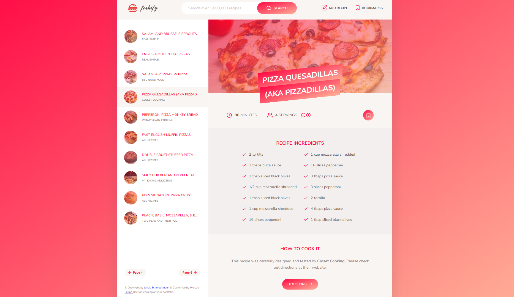

<div id="top"></div>


### Table of Contents

- [About The Project](#about-the-project)
- [Features](#features)
- [Flowchart](#flowchart)
- [How To Use](#how-to-use)
- [Tree-structure](#tree-structure)
- [License](#license)

<!-- ABOUT THE PROJECT -->

## About The Project

Forkify is a recipe web app using the [Forkify API](https://forkify-api.herokuapp.com/v2) to allow users to search, view, modify, bookmark and add recipes.

- Available search queries : [Queries](https://forkify-api.herokuapp.com/phrases.html)

## Application Demo


## Features

| User Stories                                                               | Latest features                                                                                                                                                                              |
| -------------------------------------------------------------------------- | ------------------------------------------------------------------------------------------------------------------------------------------------------------------------------------- |
| Search for recipes                                                         | <ul><li>functionality: input field to send request to API with searched keywords<li>Display results with pagination<li>Display recipe with cooking time, serving and ingredients</ul> |
| Update the number of servings                                              | <ul><li>Change serving functionality: update all ingredients according ro current number of servings</ul>                                                                             |
| Bookmark recipes                                                           | <ul><li>Bookmarking functionality: display list of all bookmarked recipes</ul>                                                                                                        |
| Create recipes                                                             | <ul><li>Users can upload their own recipes</li><li>User recipes will automatically be bookmarked<li>User can only see their own recipes, not recipes from other users</ul>            |
| Access to bookmarks and recipes when leaving the app and coming back later | <ul><li>Store bookmark data in the browser using "local storage"</ul>                                                                                                                 |

---

### Built With

- HTML
- CSS
- SASS
- JavaScript
- Parcel
- Babel
- Forkify API
- Libraries
  - fractional

---

## Flowchart


### Architecture


---

<!-- GETTING STARTED -->

## How To Use

This project require some prequesites and dependenscies to be installed, you can view it online using this [demo](https://forkify-recipe.vercel.app). or you can find the instructions below

### Installation

1. Get a free API Key at [Forkify API_KEY](https://forkify-api.herokuapp.com/v2)
2. Clone the repo
   ```sh
   git clone https://github.com/mersad-Bxtrue/forkify.git
   ```
3. Go to project folder
    ```sh
    cd forkify
    ```
4. Install NPM packages
   ```sh
   npm install
   ```
5. Enter your API in `config.js`
   ```JS
   const KEY = 'ENTER YOUR API';
   ```
6. Run start script
    ```sh
    npm run start
    ```

## Tree Structure

```
forkify
│   .gitignore
│   .prettierrc
│   index.html
│   package-lock.json
│   package.json
│   README.md
│
└───src
    ├───img
    │       demo.png
    │       favicon.png
    │       forkify-architecture-recipe-loading.png
    │       forkify-flowchart.png
    │       icons.svg
    │       logo.png
    │
    ├───js
    │   │   config.js
    │   │   controller.js
    │   │   helpers.js
    │   │   model.js
    │   │
    │   └───views
    │           addRecipeView.js
    │           bookmarksView.js
    │           paginationView.js
    │           previewView.js
    │           recipeView.js
    │           resultsView.js
    │           searchView.js
    │           View.js
    │
    └───sass
            main.scss
            _base.scss
            _components.scss
            _header.scss
            _preview.scss
            _recipe.scss
            _searchResults.scss
            _upload.scss
```

<!-- ACKNOWLEDGMENTS -->

### Thanks To

- I built the app with the help of Jonas Schmedtmann in the JavaScript course: [JavaScript course](https://www.udemy.com/course/the-complete-javascript-course/)

## License

Distributed under the MIT License. See `LICENSE` for more information.
